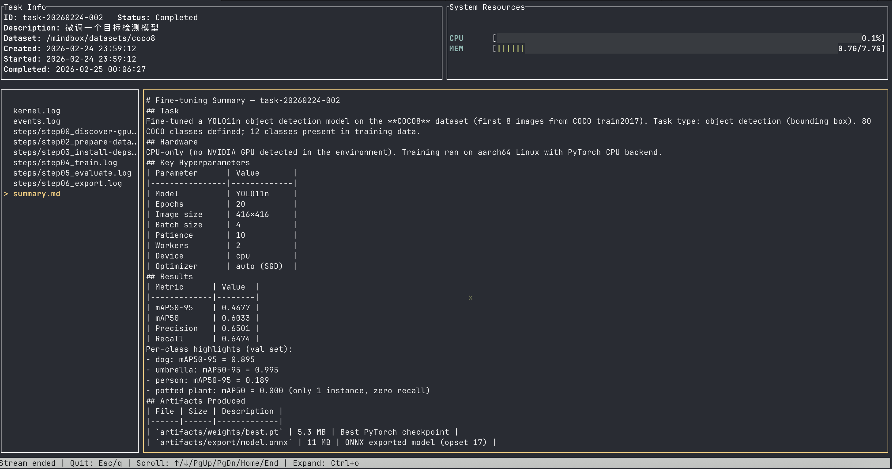

# Mindbox

> **Warning:** This project is in **Alpha** stage. Do not use it in production environments.

Mindbox is an agentic platform for automated model fine-tuning workflows.

It helps you:
- Understand task intent from natural-language descriptions
- Match relevant skills (`mindbox-skills/*/SKILL.md`)
- Generate task scripts/configs in per-task workspaces
- Execute jobs and stream logs in real time
- Persist artifacts (weights, reports, exports)

## Architecture

```text
┌─────────────────────────────────────────────────────────┐
│              User Terminal (local or remote)            │
│                                                         │
│  ┌────────────┐                                         │
│  │ mindbox-cli│  ◀── User interaction entry point       │
│  └─────┬──────┘                                         │
│        │ HTTP / SSE                                     │
└────────┼────────────────────────────────────────────────┘
         ▼
┌─────────────────────────────────────────────────────────┐
│                 Mindbox Docker Container                │
│                                                         │
│  ┌────────────┐                                         │
│  │  mindbox   │  ◀── REST API + SSE service            │
│  │  server    │      Global task lock (single-task)    │
│  └─────┬──────┘                                         │
│        ▼                                                │
│  ┌────────────┐     ┌─────────────────┐                │
│  │  mindbox   │────▶│  mindbox-skills │                │
│  │  kernel    │     │ (SKILL.md set)  │                │
│  └─────┬──────┘     └─────────────────┘                │
│        ▼                                                │
│  ┌──────────────────────────────────┐                   │
│  │      Execution Environment       │                   │
│  │   Python / PyTorch / HF stack   │                   │
│  │   GPU Runtime (CUDA), multi-GPU │                   │
│  └──────────────────────────────────┘                   │
└─────────────────────────────────────────────────────────┘
```

## Repository Layout

```text
mindbox/
├── mindbox-cli/        # CLI (clap + ratatui)
├── mindbox-server/     # API/SSE server (axum)
├── mindbox-kernel/     # Kernel abstraction and providers
├── mindbox-common/     # Shared config/types/errors
├── mindbox-skills/     # Skill definitions (SKILL.md)
├── docs/               # Architecture notes and screenshots
```

## Screenshot



## Supported Kernels

| Kernel | `MINDBOX_KERNEL` | Status | Notes |
|---|---|---|---|
| Claude Code | `claude-code` | Supported | Current production path; requires Anthropic credentials. |
| Codex | `codex` | Not implemented | Placeholder only. |

## Prerequisites

- Docker + Docker Compose
- (Optional) NVIDIA GPU runtime
- Anthropic credentials for Claude Code
- Rust toolchain (edition 2024) if you run CLI from source

## Quick Start (Recommended)

This flow uses:
- Docker for `mindbox-server`
- local Rust for `mindbox-cli`

1. Configure `.env` in repo root:

```bash
# Kernel selection
MINDBOX_KERNEL=claude-code

# Claude Code credentials
ANTHROPIC_API_KEY="<your_api_token>"

# Optional provider/model settings used by Claude Code CLI
ANTHROPIC_BASE_URL="<api_base_url>"
ANTHROPIC_MODEL=anthropic/claude-sonnet-4.6
```

Note: Docker entrypoint still accepts legacy `ANTHROPIC_AUTH_TOKEN` and maps it to `ANTHROPIC_API_KEY`.

2. Prepare dataset directory on host (mounted to container as `/mindbox/datasets`):

```bash
mkdir -p data/datasets/coco8
```

3. Start server container:

```bash
docker compose up --build mindbox
```

4. In another terminal, run CLI from source:

```bash
cargo run -p mindbox-cli -- --help
cargo run -p mindbox-cli -- task create \
  --dataset /mindbox/datasets/coco8 \
  --desc "Fine-tune an object detection model"
```

## Optional: Install CLI Binary

If you prefer a direct command instead of `cargo run`:

```bash
cargo install --path mindbox-cli
mindbox-cli --help
```

## CLI Commands

```bash
# Task
mindbox-cli task create --dataset <path> --desc "<task description>"
mindbox-cli task list
mindbox-cli task attach <task_id>
mindbox-cli task stop <task_id>

# Sandbox
mindbox-cli sandbox start
mindbox-cli sandbox stop
mindbox-cli sandbox destroy
```

Notes:
- `task create` automatically enters the TUI on success.
- `task attach` shows task info, system resources, log-file sidebar, and active log panel.
- `sandbox` commands call `docker compose` in the current working directory.

## Development

```bash
# Build all crates
cargo build --workspace

# Run tests
cargo test --workspace

# Start API/SSE server (default port: 8080)
cargo run -p mindbox-server

# Show CLI help
cargo run -p mindbox-cli -- --help
```
